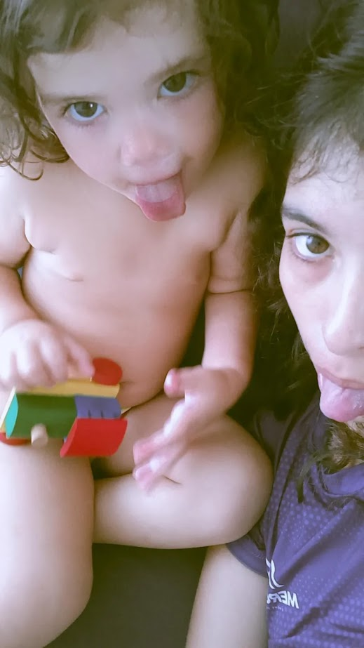

<!DOCTYPE html>
<html lang="pt-br">
<head>
    <meta charset="UTF-8">
    <meta name="viewport" content="width=device-width, initial-scale=1.0">
    <title>Feliz Aniversário, Lucas!</title>
    
</head>
<body>

    <h1>Feliz Aniversário, Lucas!</h1>
    
    

        Eu e a Scarlett queremos te dizer que você é muito especial para nós! 
        Somos imensamente gratas por tudo que você faz. 
        Te amamos muito e estamos muito felizes de comemorar esse dia com você!
    

    
    <!-- Foto corrigida -->
    
    
    

        Estou 3 dias tentando fazer isso, espero que goste hahah
    

</body>
</html>
